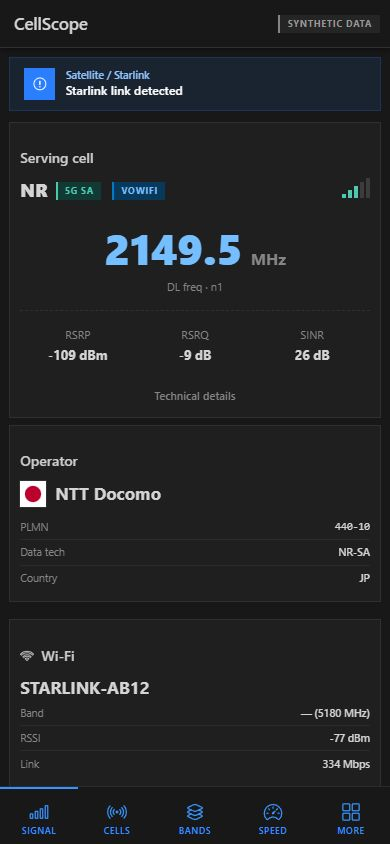
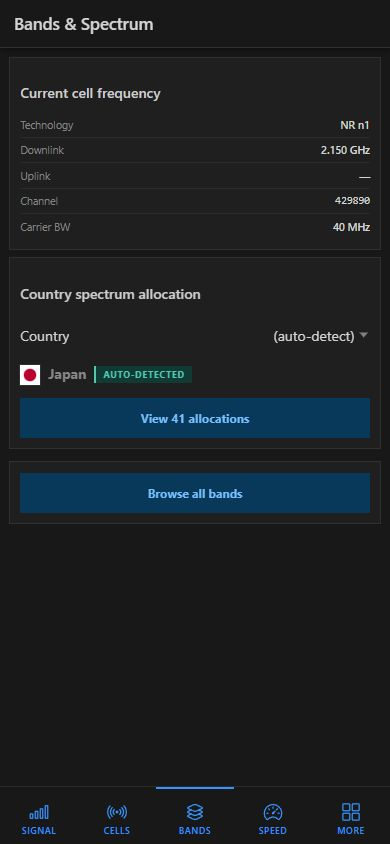
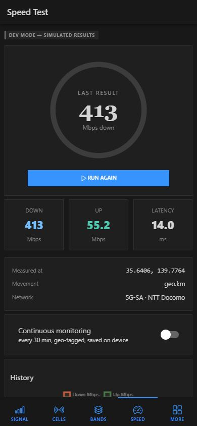
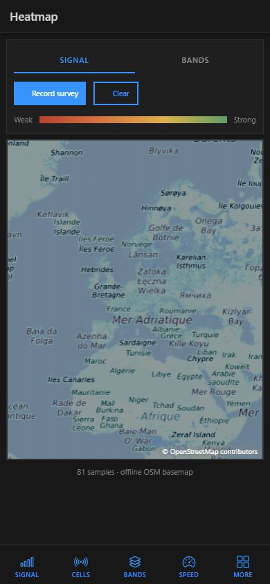

# CellScope

**An offline-first cellular & network inspector for Android** — see every detail of your radio connection: 5G SA/NSA, LTE bands and exact frequencies, neighbor cells, Wi-Fi, operator/MVNO identity, satellite (Starlink) detection, live ping, speed tests with GPS tagging, and per-country spectrum ownership. No cloud, no account, no tracking: everything is computed and stored on the device.

## Screenshots

<table>
  <tr>
    <td align="center"><br><sub>Signal dashboard</sub></td>
    <td align="center"><br><sub>Spectrum browser</sub></td>
    <td align="center"><br><sub>Speed test</sub></td>
    <td align="center"><br><sub>Signal heatmap</sub></td>
  </tr>
</table>

All screenshots use CellScope's built-in synthetic-data mode.

## Features

### Radio monitoring
- **Serving + neighbor cells** — NR (5G), LTE, WCDMA, GSM, CDMA with PCI, TAC, CID, bandwidth, RSRP/RSRQ/RSSI/SINR
- **5G SA / NSA detection** — derived from NR cell presence + data technology + EN-Dc availability
- **Exact frequencies** — offline 3GPP engine (TS 36.101 / 38.104): EARFCN, NR-ARFCN, GSM ARFCN and UTRA UARFCN converted to band numbers and DL/UL MHz
- **VoWiFi / IWLAN** and carrier-aggregation indicators
- **Starlink / NTN detection** — Android non-terrestrial-network flag, operator-name markers, Direct-to-Cell partner PLMNs, and Wi-Fi SSID/OUI heuristics

### Spectrum database (offline)
- **94 countries, ~3,000 allocations** scraped from [spectrum-tracker.com](https://www.spectrum-tracker.com) and bundled at build time
- Per-operator layers with band, duplex mode, exact UL/DL ranges and nationwide/regional scope
- Your country is **auto-detected** from the network; refresh with `npm run scrape:spectrum`

### Speed test
- HTTP-based engine (Cloudflare endpoints by default, fully configurable) with a live gauge and phase display
- **Continuous monitoring** mode — periodic geo-tagged tests saved on device
- History chart + per-test **movement delta** ("840 m from previous test")
- Official [Ookla Speedtest](https://www.speedtest.net) one tap away in a protected browser tab

### Ping
- Continuous **live mode** with a big, constantly-updating latency number
- Native ICMP via `/system/bin/ping` (no shelling into a shell — argument-injection safe)
- Session statistics (avg / min / max / jitter) auto-saved to history

### IP / ISP identification (offline)
- Compact binary database built from [iptoasn.com](https://iptoasn.com) (PDDL): **533k IPv4 + 182k IPv6 ranges, 87k organizations**
- Resolves the owner, ASN and country of any IP — including **Starlink range flagging** (AS14593, 172 live blocks)
- Public-IP auto-detection is the only online step; the lookup itself is fully offline

### GPS + offline map
- Live latitude, longitude, altitude, speed, heading and accuracy
- **Bundled OpenStreetMap basemap** (zoom 0–4, whole world, 2.3 MB — deliberately low detail), pan/pinch-zoom, speed-colored test markers
- Map data © OpenStreetMap contributors

## Privacy & permissions

CellScope reads everything **directly from your phone** — no cloud, nothing leaves the device (the only exceptions are the speed test endpoints and public-IP detection, which you trigger).

| Permission | Why |
|---|---|
| Location | Required by Android to scan nearby cells and place you on the map |
| Phone | Operator name, PLMN codes, SIM details (MVNO detection) |
| Nearby devices | Wi-Fi name and signal of the network you use |

An in-app explainer is shown once; already-granted permissions are never re-requested.

## Build

Requirements: Node 20+, JDK 21 (Gradle 8.11 refuses newer), Android SDK 35. For iOS: macOS with Xcode 15+ and CocoaPods.

```bash
npm install
npm test              # 121 TypeScript unit tests
npm run build         # web bundle + offline assets
npx cap sync android  # also: npx cap sync ios
cd android && ./gradlew assembleDebug
# APK: android/app/build/outputs/apk/debug/app-debug.apk
```

iOS: open `ios/App/App.xcworkspace` on a Mac, run `pod install` inside `ios/App` once, then build from Xcode. The Swift plugin (`CellInfoPlugin.swift`) mirrors the Android API with Apple's constraints: iOS exposes the current radio technology (LTE / 5G NSA / 5G SA), carrier identity and Wi-Fi — but **not** neighbor cells, PCI, TAC, CID or bands; the UI explains this on-device. Ping uses an ICMP DGRAM socket (Apple SimplePing technique) and reports an explicit error if the device refuses it.

Useful scripts:

| Script | Purpose |
|---|---|
| `npm test` | Vitest unit tests |
| `npm run scrape:spectrum` | Refresh the bundled spectrum database |
| `npm run build:ipdb` | Rebuild the offline IP→ISP binary |
| `node tools/fetch-tiles.mjs` | Re-download the OSM tile bundle |

Release builds expect `android/key.properties` pointing to your own keystore (gitignored); R8 minification and resource shrinking are enabled with mapping output.

## Architecture

```
src/app
├── data/        offline engines: bands (3GPP tables), PLMN/MVNO DB,
│                spectrum dataset, Starlink heuristics
├── services/    native bridge (+dev-mode fake injection), store,
│                speed engine, IP→ASN binary lookup
├── components/  OSM canvas map, signal bars, sparkline, flag
└── pages/       dashboard, cells, spectrum, speed, ping, ipinfo,
                 operators, history, ookla, more, settings

android/app/src/main/java/com/cellscope/app
├── CellInfoPlugin.java   telephony/Wi-Fi/ping/permissions bridge
└── PingParser.java       pure ping-output parser (JUnit tested)
```

- **Custom Capacitor plugin** (`CellInfo`) exposes telephony, Wi-Fi, capabilities and ICMP ping; all parsing of hidden Android APIs is version-guarded with reflection fallbacks
- **Dev mode** (unlock code `dev` in Settings) replaces every modem/Wi-Fi/ping/speed value with realistic synthetic data, clearly badged — useful for demos and screenshots

## Data sources & licenses

| Dataset | Source | License |
|---|---|---|
| Spectrum allocations | spectrum-tracker.com | share-alike, attribution kept |
| IP → ASN/org | iptoasn.com | PDDL (public domain) |
| Map tiles | OpenStreetMap contributors | ODbL / CC-BY-SA |
| Band tables | 3GPP TS 36.101 / 38.104 | public specification |

## CI

GitHub Actions runs the unit tests on every push and uploads a debug APK artifact — see `.github/workflows/build.yml`.
